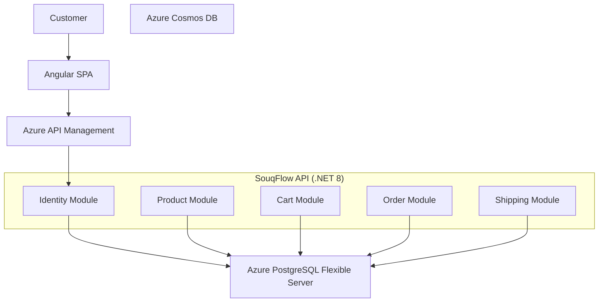

# SouqFlow

Cloud Native Commerce & Fulfillment Platform
## Features

- Product Catalog
- Shopping Cart
- Order Management
- Shipping Tracking
- JWT Authentication
- Notification

## Technology Stack

- Angular
- .NET 10
- PostgreSQL
- Docker
- Azure

SouqFlow -Architecture Diagrams 

## SouqFlow V1 Architecture

